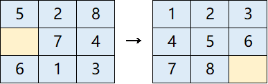

# N_puzzle
Two algorithms to solve [N_puzzle problem](https://en.wikipedia.org/wiki/15_puzzle).

## Requirements
- Python3

## Algorithms
- BFS (Breadth-first search)
    - Can find an optimal solution, but time-consuming.
- A* algorithm
    - An efficient heuristic algorithm.
    - Cost function：`steps_from_start + manhattan_distance_to_goal`
